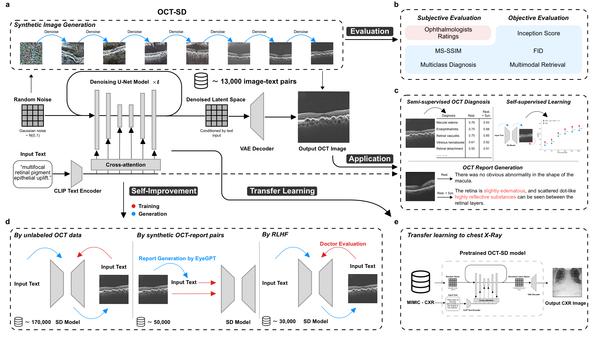

#  OCT-SD

## Overview

This project focuses on fine-tuning a Stable Diffusion model for the generation and evaluation of synthetic OCT (Optical Coherence Tomography) images. The model is trained to enhance the quality of generated images using custom datasets.

# 

## OCT-SD Architecture

The system consists of the following components:

- **Synthetic Image Generation**: Utilizes a denoising sequence to generate images from random noise, which is shaped by text descriptions through a CLIP Text Encoder. The system can self-improve through training and generation loops.
- **Evaluation**: Combines subjective evaluations by ophthalmologists with objective evaluations using Inception Score, FID, and MS-SSIM metrics.
- **Application**: Enables applications such as semi-supervised OCT diagnosis with real and synthetic images, contributing to enhanced report generation and semi-supervised learning.
- **Report Generation**: Employs synthetic OCT-report pairs to facilitate the creation of medical reports, harnessing unlabeled OCT data.
- **Transfer Learning to Chest X-Ray**: Demonstrates the model's versatility by applying transfer learning to a pretrained OCT-SD model for generating chest X-ray images.

## Training Process

To initiate the training process, execute the `train.sh` shell script from the terminal:

```
bash ./train.sh
```

This script sets up environment variables required for the training process, such as the model name, dataset name, and CUDA device configuration. It then launches the training process with specified parameters such as the batch size, learning rate, and maximum number of training steps.

### Script Parameters

- **--num_processes**: Number of processes to use for data loading.
- **--mixed_precision**: Precision mode for training to improve performance.
- **--train_data_dir**: Directory containing the training data.
- **--resolution**: Resolution for the generated images.
- **--center_crop**: Apply center cropping to the training images.
- **--random_flip**: Apply random flipping to the training images.
- **--train_batch_size**: Number of images per training batch.
- **--max_train_steps**: Maximum steps for the training process.
- **--learning_rate**: Learning rate for the optimizer.
- **--output_dir**: Directory to save the trained model.

## Synthetic Dataset Generation

To generate a synthetic dataset, use the `generate_synthetic_dataset.py` script. This script will utilize the fine-tuned model to produce synthetic OCT images.
